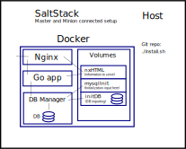

# abc-demo
Good day, this is repository that builds demo infrastructure.



Usage:
```bash
$ git clone https://github.com/Anton-Latukha/abcd-demo.git
$ cd abcd-demo
# sh ./install.sh
```

### Salt and Docker/Docker-Compose
From official Salt formula: (1)[https://github.com/saltstack-formulas/docker-formula#docker-compose-ng]
No real effort had been made to support every possible feature of docker-compose. Rather, we prefer the syntax provided by the docker-compose whenever it is reasonable for the sake of simplicity.

Also official Salt:
salt.modules.dockercompose module: depends:	docker-compose>=1.5
And needs manual docker-compose install anyway.

Also official Salt:
>This is a first version only, the following commands are missing at the moment but will be built later on if the community is interested in this module:

>  -  run
>  -  logs
>  -  port
>  -  scale

As we can see, SaltStack does not fully implement Docker API still. So level-up Docker infrastructure to Salt level is not a good idea.

It is convenient to use Docker through Salt targeting and commands to work with Docker sources. And use modules, function whenever it is handy.
