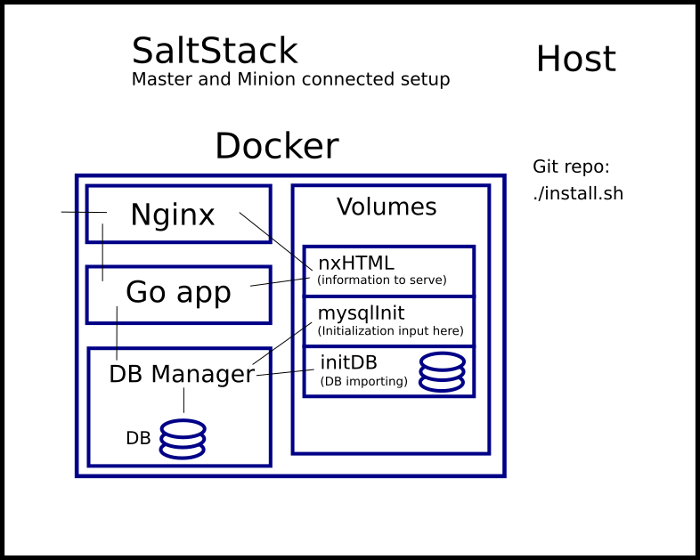

# Demo
This is repository that builds demo infrastructure.



For deployment on Ubuntu Server 16.04.

Usage:
```bash
$ git clone https://github.com/Anton-Latukha/demo.git
$ cd demo
# sh ./install.sh
```

That's all you need to do.

Git does not store file metainformation. And also script doesn't need permissions, if you run it through shell.

## What happens during install.sh
1. Installs Docker official way on Ubuntu Server 16.04.
2. As, I use newest standards of Docker Compose, and 16.04 still supports two generations behind, we use official hack, installing new Docker Compose in the container. And providing full CLI capabilities to the host system. So all we get is only a benefit.
3. Basic hardening of that Docker Compose setup (`/usr/local/bin/docker-compose` access, which is not documented thing). More over, they do stupid mistake in [official documentation](https://docs.docker.com/compose/install/#install-as-a-container). Their instruction `sudo chmod +x /usr/local/bin/docker-compose` which opens access to everyone and their uncle on the system, anyone that can get in the server, feed execution command to any process, jailbrake from any process, service, gain non-privileged access - can execute Docker Compose. The thing is Docker Compose is a privilege escalator. Compose commands what to do to Docker daemon, that has ROOT privileges on the host system (this is about engine, user access to `Docker` execution command is simple)(while running Docker engine as non ROOT is unmatched tasks, because Docker has requirements to create devices, configure networks, cgroups, forging packets, using different capabilities on containers, and other Kernel topics and so on). So they open all that possibilities to anyone with that single command.
4. Setting up SaltStack Master and Minion in official way. Configuring Minion to listen to Master.
5. Minion knows where to send a key now. It sends a key, and Master waits on it. When Master receives - accepts that key. Wait a bit till Minion receives news and initializes. And sends backward a testing command. And waits on response.
5. Docker infrastructure gets alive.
6. `mysql_init_data` container builds. `initDB` volume populates with DB that information is going to be imported from to working Data Base. `mysqlInit` volume populates with init entering point. As we don't want to init-run everything that is in `initDB`, we only want to run what we need there.
7. `mysql` container runs. It mounts `initDB` and `mysqlInit`. It was done so, so `mysql` image is intact official image, so we get upstream maintenance on it. If we build another image on top of it - we need to sync-back that image with upstream. That is why it done is `mysql` & `mysql_init_data` containers way. DB init looks for all it can get to execute in /docker-entrypoint-initdb.d, which is mounted to `mysqlInit` volume. So after DB manager is ready - it runs our init entering point script, that relocates to `initDB` directory and imports what we need from there.
8. Simultaneously Go container runs. It is prepopulated with Go application I have written. It is prepopulated with sources of it, and container on start builds Go application and executes it. Go is known for fast compilation (Google had old-school assembly team to optimize compilation, they built new assembly platform, that is very modular, automated and straight easy for adding new architectures in it, is years ahead of most used old solutions). Application initializes, creates a DB handle and knocks on the DB we importing.
9. Application waits on DB becoming ready. Than sends SQL request to it. It asks to get list of employees that are Male, which birth date is 1965-02-01, and the hire date is greater than 1990-01-01, ordered by the Full Name of the employee. It prints result to CLI and also creates HTML to be served on the web and puts it in `nxHTML`.
10.  Nginx gets page from `nxHTML` and serves it on port 80.
11.  You can access that page and see information.


Sources is mostly commented, you can check them out.
