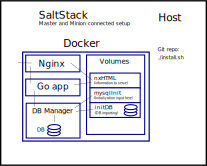

# Demo
Good day, this is repository that builds demo infrastructure.



Usage:
```bash
$ git clone https://github.com/Anton-Latukha/demo.git
$ cd demo
# sh ./install.sh
```

Git does not store file metainformation. And also script doesn't need permissions, if you run it through shell.

That's all you need to do.

Sources is mostly commented, you can check them out.